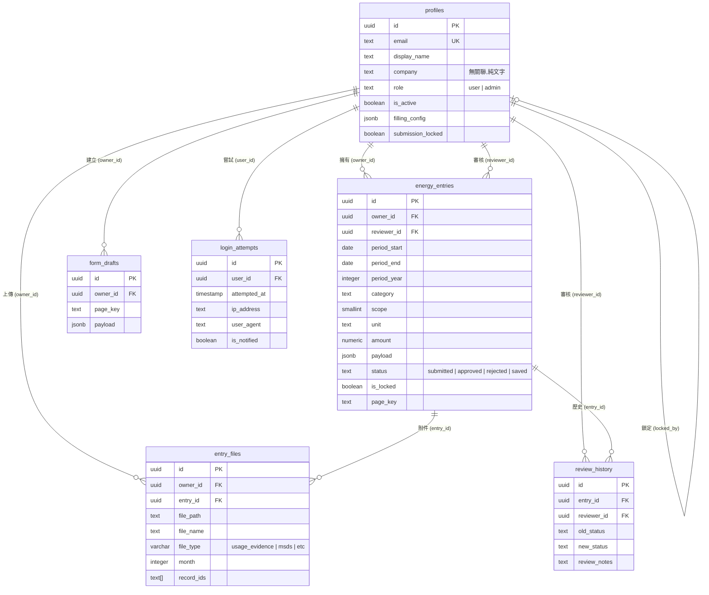
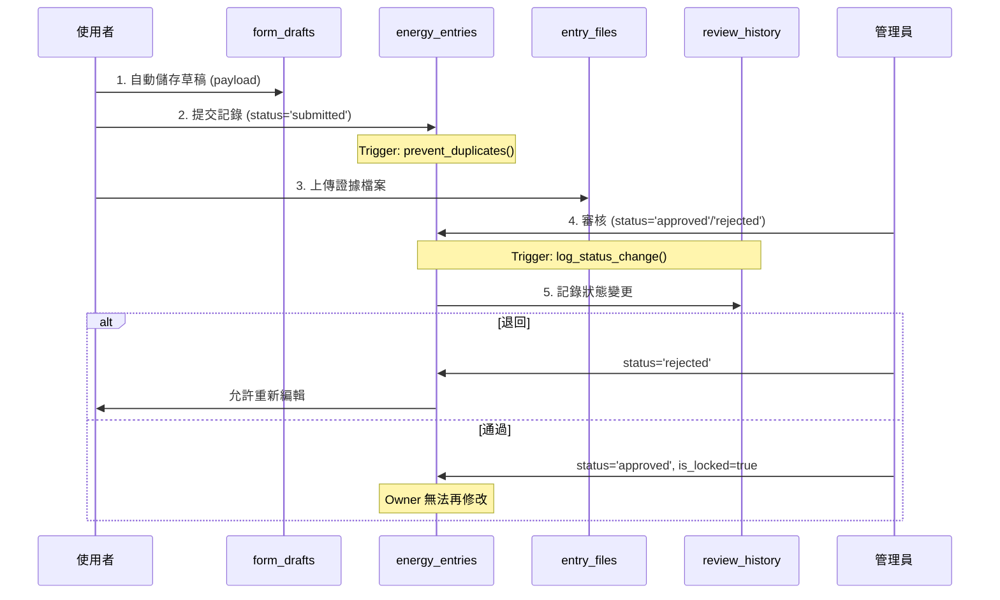

# 碳足跡管理系統 - 資料庫文件

> **最後更新:** 2025-11-03
> **資料庫:** PostgreSQL (Supabase)
> **Schema 版本:** 1.0

---

## 目錄

1. [系統概述](#系統概述)
2. [ER 關係圖](#er-關係圖)
3. [資料表詳細說明](#資料表詳細說明)
4. [RLS 安全政策](#rls-安全政策)
5. [觸發器與函數](#觸發器與函數)
6. [索引策略](#索引策略)
7. [常見查詢範例](#常見查詢範例)
8. [已知限制](#已知限制)

---

## 系統概述

### 架構特點

- **認證系統**: Supabase Auth (auth.users)
- **權限控制**: Row Level Security (RLS)
- **檔案儲存**: Supabase Storage
- **總表數**: 6 張 (public schema)

### 核心概念

1. **單人編輯架構**: 每筆 `energy_entries` 只能由 `owner_id` 編輯
2. **管理員特權**: `is_admin()` 函數判斷,可存取所有資料
3. **狀態流轉**: `submitted` → `approved`/`rejected` (單向)
4. **證據檔案**: 與 entry 關聯,支援多對一
5. **單一登入控制**: 同帳號只能一處登入,新登入嘗試被阻擋並通知現有用戶

---

## ER 關係圖



---

## 資料表詳細說明

### 1. `profiles` - 使用者資料表

**用途**: 擴充 auth.users,儲存使用者基本資料與系統設定

| 欄位名 | 型別 | Nullable | 預設值 | 說明 |
|--------|------|----------|--------|------|
| `id` | uuid | NO | `gen_random_uuid()` | 主鍵,對應 auth.users.id |
| `email` | text | NO | - | Email (唯一) |
| `display_name` | text | YES | - | 顯示名稱 |
| `company` | text | YES | - | **公司名稱 (純文字標籤,無關聯!)** |
| `job_title` | text | YES | - | 職稱 |
| `phone` | text | YES | - | 電話 |
| `role` | text | NO | `'user'` | 角色: `user` 或 `admin` |
| `is_active` | boolean | NO | `true` | 帳號啟用狀態 |
| `report_start_date` | date | YES | - | 填報起始日期 |
| `report_end_date` | date | YES | - | 填報結束日期 |
| `filling_config` | jsonb | YES | 見下方 | 填報設定 |
| `submission_locked` | boolean | YES | `false` | 是否鎖定提交 |
| `locked_by` | uuid | YES | - | FK → profiles.id (誰鎖定此用戶) |
| `locked_at` | timestamp | YES | - | 鎖定時間 |
| `created_at` | timestamp | YES | `now()` | 建立時間 |
| `updated_at` | timestamp | YES | `now()` | 更新時間 |

**填報設定預設值** (`filling_config`):
```json
{
  "energy_categories": [
    "wd40", "acetylene", "refrigerant", "septic_tank",
    "natural_gas", "urea", "diesel_generator", "diesel",
    "gasoline", "lpg", "welding_rod", "fire_extinguisher",
    "electricity", "employee_commute"
  ],
  "target_year": 2024
}
```

**注意**:
- `energy_categories` 列表為用戶可存取的能源類別
- `target_year` 為用戶的目標盤查年份
- 柴油發電機 (`diesel_generator`) 現已統一為標準能源類別，不再需要特殊的版本配置

**外鍵**:
- `locked_by` → `profiles(id)` (自我參照)

**索引**:
- PRIMARY KEY: `id`
- 無額外索引

---

### 2. `energy_entries` - 能源填報記錄

**用途**: 儲存使用者提交的碳排放數據

| 欄位名 | 型別 | Nullable | 預設值 | 說明 |
|--------|------|----------|--------|------|
| `id` | uuid | NO | `gen_random_uuid()` | 主鍵 |
| `owner_id` | uuid | NO | - | FK → profiles.id (資料擁有者) |
| `period_start` | date | NO | - | 期間開始日 |
| `period_end` | date | NO | - | 期間結束日 |
| `period_year` | integer | NO | - | 年份 (方便查詢) |
| `category` | text | NO | - | 能源類別 (如 `diesel`, `electricity`) |
| `scope` | smallint | YES | - | 碳排放範疇 (1, 2, 3) |
| `unit` | text | NO | - | 單位 (如 `kWh`, `L`) |
| `amount` | numeric | NO | - | 用量 |
| `total_amount` | numeric | YES | - | 總用量 (計算欄位) |
| `notes` | text | YES | - | 備註 |
| `payload` | jsonb | YES | - | **完整表單資料 (JSON)** |
| `status` | text | NO | `'submitted'` | 狀態: `saved`, `submitted`, `approved`, `rejected` |
| `is_locked` | boolean | YES | `false` | 是否鎖定 (審核中/已審核) |
| `page_key` | text | YES | - | 頁面識別碼 (對應前端路由) |
| `reviewer_id` | uuid | YES | - | FK → profiles.id (審核者) |
| `review_notes` | text | YES | - | 審核意見 |
| `reviewed_at` | timestamp | YES | - | 審核時間 |
| `created_at` | timestamp | YES | `now()` | 建立時間 |
| `updated_at` | timestamp | YES | `now()` | 更新時間 (自動更新) |

**外鍵**:
- `owner_id` → `profiles(id)` ON DELETE CASCADE
- `reviewer_id` → `profiles(id)` ON DELETE SET NULL

**唯一約束**:
- `uq_user_category_year`: `(owner_id, category, period_year)` - 同一用戶每年每類別只能有一筆記錄

**索引**:
- `idx_entries_owner`: `owner_id`
- `idx_entries_owner_year`: `(owner_id, period_year)`
- `idx_entries_status`: `status`
- `idx_entries_category`: `category`
- `idx_entries_page_key`: `page_key`
- `idx_entries_period`: `(period_start, period_end)`
- `idx_entries_reviewer`: `reviewer_id`
- `idx_entries_reviewed`: `reviewed_at`
- `idx_entries_locked`: `is_locked`
- `idx_entries_scope`: `scope`
- `idx_entries_created`: `created_at`

---

### 3. `entry_files` - 證據檔案

**用途**: 儲存與能源記錄相關的證據檔案 (儲存在 Supabase Storage)

| 欄位名 | 型別 | Nullable | 預設值 | 說明 |
|--------|------|----------|--------|------|
| `id` | uuid | NO | `gen_random_uuid()` | 主鍵 |
| `owner_id` | uuid | NO | - | FK → profiles.id (上傳者) |
| `entry_id` | uuid | NO | - | FK → energy_entries.id (關聯記錄) |
| `file_path` | text | NO | - | Storage 路徑 |
| `file_name` | text | NO | - | 檔案名稱 |
| `mime_type` | text | YES | - | MIME 類型 |
| `file_size` | bigint | YES | - | 檔案大小 (bytes) |
| `file_type` | varchar(20) | NO | `'usage_evidence'` | 檔案類型 (見下方) |
| `month` | integer | YES | - | 月份 (1-12) |
| `page_key` | text | YES | - | 頁面識別碼 |
| `record_index` | integer | YES | - | 記錄索引 (多筆時使用) |
| `record_id` | text | YES | - | 記錄 ID (單一關聯) |
| `record_ids` | text[] | YES | - | **記錄 ID 陣列 (多對多關聯)** |
| `created_at` | timestamp | NO | `now()` | 上傳時間 |

**file_type 列舉值**:
- `usage_evidence` - 使用量證明
- `msds` - 物質安全資料表
- `heat_value_evidence` - 熱值證明
- `annual_evidence` - 年度證明
- `nameplate_evidence` - 銘牌證明
- `other` - 其他

**外鍵**:
- `owner_id` → `profiles(id)` ON DELETE CASCADE
- `entry_id` → `energy_entries(id)` ON DELETE CASCADE

**索引**:
- `idx_files_entry`: `entry_id`
- `idx_files_created`: `created_at`
- `idx_entry_files_record_ids`: GIN index on `record_ids` (陣列搜尋)

---

### 4. `form_drafts` - 表單草稿

**用途**: 自動儲存使用者填寫中的表單資料

| 欄位名 | 型別 | Nullable | 預設值 | 說明 |
|--------|------|----------|--------|------|
| `id` | uuid | NO | `gen_random_uuid()` | 主鍵 |
| `owner_id` | uuid | NO | - | FK → profiles.id |
| `page_key` | text | NO | - | 頁面識別碼 (唯一 per user) |
| `payload` | jsonb | NO | - | 草稿資料 (JSON) |
| `updated_at` | timestamp | NO | `now()` | 最後更新時間 |

**外鍵**:
- `owner_id` → `profiles(id)` ON DELETE CASCADE

**索引**:
- PRIMARY KEY: `id`
- 無額外索引 (查詢量低)

---

### 5. `review_history` - 審核歷史

**用途**: 記錄所有審核操作的歷史,用於稽核追蹤

| 欄位名 | 型別 | Nullable | 預設值 | 說明 |
|--------|------|----------|--------|------|
| `id` | uuid | NO | `gen_random_uuid()` | 主鍵 |
| `entry_id` | uuid | YES | - | FK → energy_entries.id |
| `reviewer_id` | uuid | YES | - | FK → profiles.id (審核者) |
| `old_status` | text | YES | - | 原狀態 |
| `new_status` | text | YES | - | 新狀態 |
| `review_notes` | text | YES | - | 審核意見 |
| `created_at` | timestamp | YES | `now()` | 操作時間 |

**外鍵**:
- `entry_id` → `energy_entries(id)` ON DELETE SET NULL
- `reviewer_id` → `profiles(id)` ON DELETE SET NULL

**索引**:
- PRIMARY KEY: `id`
- 無額外索引

---

### 6. `login_attempts` - 登入嘗試記錄

**用途**: 記錄被阻擋的登入嘗試,實現單一登入控制並通知現有用戶

| 欄位名 | 型別 | Nullable | 預設值 | 說明 |
|--------|------|----------|--------|------|
| `id` | uuid | NO | `gen_random_uuid()` | 主鍵 |
| `user_id` | uuid | NO | - | FK → auth.users.id (被嘗試登入的帳號) |
| `attempted_at` | timestamp | NO | `now()` | 嘗試登入時間 |
| `ip_address` | text | YES | - | 嘗試來源 IP |
| `user_agent` | text | YES | - | 瀏覽器資訊 |
| `is_notified` | boolean | NO | `false` | 是否已通知用戶 |
| `created_at` | timestamp | NO | `now()` | 記錄建立時間 |

**外鍵**:
- `user_id` → `auth.users(id)` ON DELETE CASCADE

**索引**:
- PRIMARY KEY: `id`
- `idx_login_attempts_user`: `user_id` (查詢某用戶的嘗試記錄)
- `idx_login_attempts_notified`: `(user_id, is_notified)` (查詢未讀通知)

**業務邏輯**:
1. 當有人嘗試登入已登入的帳號時,系統寫入此表
2. 前端輪詢 `get_unread_login_attempts()` 取得未讀通知
3. 用戶確認後呼叫 `mark_login_attempts_as_read()` 標記已讀

**安全考量**:
- 此表無 RLS Policy,完全由 RPC 函數控制存取
- 用戶只能看到自己的記錄 (透過 `get_unread_login_attempts()`)
- 管理員也無法直接查詢 (避免隱私洩漏)

---

## RLS 安全政策

### 權限矩陣

| 表名 | SELECT | INSERT | UPDATE | DELETE | 說明 |
|------|--------|--------|--------|--------|------|
| **profiles** | Owner or Admin | Admin only | Owner or Admin | Admin only | 用戶可看/改自己 |
| **energy_entries** | Owner or Admin | Owner | Owner (限狀態) or Admin | Owner or Admin | 審核後鎖定 |
| **entry_files** | Owner or Admin | Owner or Admin | Owner or Admin | Owner or Admin | 完全由 owner 控制 |
| **form_drafts** | Owner | Owner | Owner | Owner | 完全隔離 |
| **review_history** | Admin only | Any auth | - | - | 只有管理員可查看 |
| **login_attempts** | 無 RLS | RPC only | RPC only | - | 完全由 RPC 控制 |

### Policy 詳細說明

#### 1. `profiles` - `profiles_own_access`
```sql
ALL: (auth.uid() = id) OR is_admin()
```
- 用戶可存取自己的 profile
- 管理員可存取所有 profiles

#### 2. `energy_entries` - SELECT
```sql
SELECT: (auth.uid() = owner_id) OR is_admin()
```
- 用戶只能看自己的記錄
- 管理員可看所有記錄

#### 3. `energy_entries` - INSERT
```sql
INSERT: auth.uid() = owner_id
```
- 只能為自己建立記錄
- 不能幫別人建立

#### 4. `energy_entries` - UPDATE (`entries_update_v7`)
```sql
UPDATE (USING):
  ((auth.uid() = owner_id) AND (status IN ('saved', 'submitted', 'rejected')))
  OR is_admin()

UPDATE (WITH CHECK):
  (auth.uid() = owner_id) OR is_admin()
```
- **USING (查詢條件)**:
  - Owner 只能更新狀態為 `saved`, `submitted`, `rejected` 的記錄
  - `approved` 記錄完全鎖定,owner 無法修改
  - 管理員不受限制

- **WITH CHECK (寫入驗證)**:
  - Owner 或管理員才能執行更新
  - 防止 owner_id 被竄改

#### 5. `energy_entries` - DELETE
```sql
DELETE: (auth.uid() = owner_id) OR is_admin()
```
- Owner 或管理員可刪除

#### 6. `entry_files` - `files_user_access`
```sql
ALL: (auth.uid() = owner_id) OR is_admin()
```
- 檔案擁有者或管理員完全控制

#### 7. `form_drafts` - `form_drafts_own_access`
```sql
ALL: auth.uid() = owner_id
```
- 完全隔離,只能存取自己的草稿
- 管理員也無法存取他人草稿

#### 8. `review_history` - SELECT
```sql
SELECT: is_admin()
```
- 只有管理員可查看審核歷史

#### 9. `review_history` - INSERT
```sql
INSERT (authenticated role): true
```
- 任何登入用戶可寫入歷史記錄
- 配合觸發器自動記錄

---

### `is_admin()` 函數

**定義**:
```sql
CREATE OR REPLACE FUNCTION public.is_admin()
RETURNS boolean
LANGUAGE plpgsql
SECURITY DEFINER
SET search_path TO 'public'
AS $function$
BEGIN
    RETURN EXISTS (
        SELECT 1 FROM profiles
        WHERE id = auth.uid()
        AND role = 'admin'
        AND is_active = true
    );
END;
$function$
```

**功能**: 判斷當前登入用戶是否為啟用的管理員
**安全性**: `SECURITY DEFINER` - 以函數擁有者權限執行,繞過 RLS

---

### 單一登入控制函數

系統提供三個 RPC 函數實現單一登入控制:

#### 1. `check_active_session(check_email TEXT)` - 檢查活躍 session

**用途**: 登入前檢查該帳號是否已在其他裝置登入

**定義**:
```sql
CREATE OR REPLACE FUNCTION public.check_active_session(check_email TEXT)
RETURNS JSON
LANGUAGE plpgsql
SECURITY DEFINER
SET search_path = public, auth
AS $function$
DECLARE
  target_user_id UUID;
  active_session_count INT;
BEGIN
  -- 1. 查詢用戶 ID
  SELECT id INTO target_user_id
  FROM auth.users
  WHERE email = check_email
  LIMIT 1;

  IF target_user_id IS NULL THEN
    RETURN json_build_object(
      'has_active_session', false,
      'message', 'User not found'
    );
  END IF;

  -- 2. 檢查 auth.sessions 是否有未過期的 session
  SELECT COUNT(*) INTO active_session_count
  FROM auth.sessions
  WHERE user_id = target_user_id
    AND (not_after IS NULL OR not_after > NOW());

  -- 3. 如果有 active session,記錄嘗試並返回
  IF active_session_count > 0 THEN
    INSERT INTO public.login_attempts (user_id)
    VALUES (target_user_id);

    RETURN json_build_object(
      'has_active_session', true,
      'message', 'Account is already logged in',
      'user_id', target_user_id,
      'active_sessions', active_session_count
    );
  END IF;

  RETURN json_build_object(
    'has_active_session', false,
    'message', 'OK to login',
    'user_id', target_user_id
  );
END;
$function$;
```

**返回格式**:
```json
{
  "has_active_session": true,
  "message": "Account is already logged in",
  "user_id": "uuid",
  "active_sessions": 2
}
```

**安全性**:
- `SECURITY DEFINER` - 可存取 `auth.sessions` (一般用戶無權限)
- `SET search_path` - 防止 search_path 注入攻擊
- 自動記錄嘗試到 `login_attempts` 表

---

#### 2. `get_unread_login_attempts()` - 取得未讀通知

**用途**: 前端輪詢此函數,取得被阻擋的登入嘗試記錄

**定義**:
```sql
CREATE OR REPLACE FUNCTION public.get_unread_login_attempts()
RETURNS TABLE(
  id UUID,
  attempted_at TIMESTAMP WITH TIME ZONE,
  ip_address TEXT,
  user_agent TEXT
)
LANGUAGE plpgsql
SECURITY DEFINER
SET search_path = public
AS $function$
BEGIN
  -- 只返回當前用戶且未讀的記錄
  RETURN QUERY
  SELECT
    la.id,
    la.attempted_at,
    la.ip_address,
    la.user_agent
  FROM public.login_attempts la
  WHERE la.user_id = auth.uid()
    AND la.is_notified = false
  ORDER BY la.attempted_at DESC
  LIMIT 10;
END;
$function$;
```

**使用範例** (前端):
```typescript
const { data, error } = await supabase.rpc('get_unread_login_attempts')
// data: [{ id: 'uuid', attempted_at: '2025-11-03T...', ... }]
```

**安全性**:
- 使用 `auth.uid()` 確保只能看自己的記錄
- 限制 10 筆避免過多資料傳輸

---

#### 3. `mark_login_attempts_as_read(attempt_ids UUID[])` - 標記已讀

**用途**: 用戶確認通知後,標記為已讀

**定義**:
```sql
CREATE OR REPLACE FUNCTION public.mark_login_attempts_as_read(attempt_ids UUID[])
RETURNS VOID
LANGUAGE plpgsql
SECURITY DEFINER
SET search_path = public
AS $function$
BEGIN
  -- 只更新屬於當前用戶的記錄
  UPDATE public.login_attempts
  SET is_notified = true
  WHERE id = ANY(attempt_ids)
    AND user_id = auth.uid();
END;
$function$;
```

**使用範例** (前端):
```typescript
await supabase.rpc('mark_login_attempts_as_read', {
  attempt_ids: ['uuid1', 'uuid2']
})
```

**安全性**:
- `AND user_id = auth.uid()` - 防止標記他人記錄

---

## 觸發器與函數

### 觸發器列表

| 觸發器名稱 | 表名 | 時機 | 操作 | 函數 |
|-----------|------|------|------|------|
| `update_entries_timestamp` | energy_entries | BEFORE UPDATE | - | `update_timestamp()` |
| `update_profiles_timestamp` | profiles | BEFORE UPDATE | - | `update_timestamp()` |
| `prevent_duplicate_entries` | energy_entries | BEFORE INSERT | - | `prevent_duplicates()` |
| `log_entry_status_changes` | energy_entries | AFTER UPDATE | - | `log_status_change()` |

---

### 1. `update_timestamp()` - 自動更新時間戳

**用途**: 當記錄被更新時,自動設定 `updated_at = now()`

**觸發**:
- `energy_entries` 每次 UPDATE
- `profiles` 每次 UPDATE

**實作**:
```sql
CREATE OR REPLACE FUNCTION public.update_timestamp()
RETURNS trigger
LANGUAGE plpgsql
AS $function$
BEGIN
    NEW.updated_at = now();
    RETURN NEW;
END;
$function$
```

---

### 2. `prevent_duplicates()` - 防止重複記錄

**用途**: **刪除**同一用戶在同一年對同一類別的舊記錄 (允許覆蓋)

**觸發**: `energy_entries` BEFORE INSERT

**實作**:
```sql
CREATE OR REPLACE FUNCTION public.prevent_duplicates()
RETURNS trigger
LANGUAGE plpgsql
AS $function$
BEGIN
    -- 刪除相同用戶、相同類別、相同年份的舊記錄
    DELETE FROM energy_entries
    WHERE owner_id = NEW.owner_id
    AND category = NEW.category
    AND period_year = NEW.period_year
    AND id != NEW.id;

    RETURN NEW;
END;
$function$
```

**重要**: 這個函數**不是**防止重複,而是**允許覆蓋**!
- 新記錄會自動刪除舊記錄
- 配合 `uq_user_category_year` 約束確保唯一性

---

### 3. `log_status_change()` - 記錄狀態變更

**用途**: 當 `energy_entries.status` 改變時,自動寫入 `review_history`

**觸發**: `energy_entries` AFTER UPDATE

**實作**:
```sql
CREATE OR REPLACE FUNCTION public.log_status_change()
RETURNS trigger
LANGUAGE plpgsql
AS $function$
BEGIN
    -- 只在狀態變更時記錄
    IF OLD.status IS DISTINCT FROM NEW.status THEN
        INSERT INTO review_history (
            entry_id,
            reviewer_id,
            old_status,
            new_status,
            review_notes,
            created_at
        ) VALUES (
            NEW.id,
            NEW.reviewer_id,
            OLD.status,
            NEW.status,
            NEW.review_notes,
            now()
        );
    END IF;
    RETURN NEW;
END;
$function$
```

**重點**:
- 使用 `IS DISTINCT FROM` 處理 NULL 值
- 自動記錄審核者和時間
- 完整稽核追蹤

---

## 索引策略

### 高頻查詢索引

| 索引名 | 表 | 欄位 | 類型 | 原因 |
|--------|----|----|------|------|
| `idx_entries_owner` | energy_entries | owner_id | btree | 用戶查詢自己的記錄 (最高頻) |
| `idx_entries_owner_year` | energy_entries | (owner_id, period_year) | btree | 按年份篩選 |
| `idx_entries_status` | energy_entries | status | btree | 管理員篩選待審核 |
| `idx_entries_category` | energy_entries | category | btree | 按類別統計 |
| `idx_files_entry` | entry_files | entry_id | btree | 檔案關聯查詢 |
| `idx_entry_files_record_ids` | entry_files | record_ids | GIN | 陣列搜尋 (多對多) |

### 效能建議

1. **避免全表掃描**: 所有查詢都應該有 `owner_id` 或 `status` 條件
2. **複合索引優先**: `(owner_id, period_year)` 比單獨索引更有效
3. **GIN 索引成本**: `record_ids` 的 GIN 索引適合小規模資料 (<100萬筆)

---

## 常見查詢範例

### 1. 查詢用戶某年的所有記錄
```sql
SELECT * FROM energy_entries
WHERE owner_id = '<user_uuid>'
AND period_year = 2024
ORDER BY created_at DESC;
```
**使用索引**: `idx_entries_owner_year`

---

### 2. 管理員查詢待審核記錄
```sql
SELECT
  e.*,
  p.display_name,
  p.company
FROM energy_entries e
JOIN profiles p ON e.owner_id = p.id
WHERE e.status = 'submitted'
ORDER BY e.created_at ASC;
```
**使用索引**: `idx_entries_status`

---

### 3. 查詢某筆記錄的所有檔案
```sql
SELECT * FROM entry_files
WHERE entry_id = '<entry_uuid>'
ORDER BY created_at ASC;
```
**使用索引**: `idx_files_entry`

---

### 4. 統計某公司的碳排放總量 (按類別)
```sql
SELECT
  category,
  SUM(amount) as total_amount,
  COUNT(*) as record_count
FROM energy_entries e
JOIN profiles p ON e.owner_id = p.id
WHERE p.company = '台積電'
AND e.period_year = 2024
AND e.status = 'approved'
GROUP BY category
ORDER BY total_amount DESC;
```
**注意**: `company` 是純文字,無索引,大量資料時會慢

---

### 5. 查詢某檔案關聯的所有記錄 (多對多)
```sql
SELECT * FROM entry_files
WHERE '<record_id>' = ANY(record_ids);
```
**使用索引**: `idx_entry_files_record_ids` (GIN)

---

### 6. 審核歷史查詢
```sql
SELECT
  h.*,
  e.category,
  p.display_name as reviewer_name
FROM review_history h
JOIN energy_entries e ON h.entry_id = e.id
JOIN profiles p ON h.reviewer_id = p.id
WHERE e.owner_id = '<user_uuid>'
ORDER BY h.created_at DESC
LIMIT 50;
```
**權限**: 只有管理員可執行 (RLS 限制)

---

## 已知限制

### 1. 單人編輯架構
**現狀**: 每筆 `energy_entries` 只能由 `owner_id` 編輯
**限制**: 同公司的多個用戶無法協同編輯同一筆記錄
**影響**: 如果要支援團隊協作,需要重新設計 RLS Policy

### 2. `company` 欄位無關聯
**現狀**: `profiles.company` 是純文字,自由輸入
**限制**:
- 拼字錯誤會導致同公司被視為不同公司
- 無法統一管理公司清單
- 無法支援組織層級權限

**改進建議**:
```sql
CREATE TABLE organizations (
  id UUID PRIMARY KEY,
  name TEXT UNIQUE NOT NULL
);

ALTER TABLE profiles ADD COLUMN organization_id UUID REFERENCES organizations(id);
```

### 3. 無衝突檢測機制
**現狀**: 沒有樂觀鎖 (Optimistic Lock)
**問題**: 如果未來支援多人編輯,會有 Last-Write-Wins 問題
**改進建議**: 加入 `version` 欄位

### 4. 審核後完全鎖定
**現狀**: `status = 'approved'` 的記錄,owner 完全無法修改
**限制**: 如果資料有誤,只能由管理員手動改或退回重填
**業務邏輯**: 這是設計決策,確保已審核資料的完整性

### 5. `payload` 欄位無 Schema 驗證
**現狀**: `energy_entries.payload` 是 JSONB,無結構驗證
**風險**: 前端可以寫入任意 JSON,資料一致性由應用層保證
**改進建議**: 使用 PostgreSQL 的 `CHECK` constraint 或 JSON Schema 驗證

### 6. 檔案刪除無串接 Storage
**現狀**: 刪除 `entry_files` 記錄時,Storage 中的實體檔案不會自動刪除
**影響**: 可能造成 Storage 空間浪費
**解決方案**: 需要應用層或 Supabase Function 處理

---

## 資料流程圖

### 填報流程



---

## 附錄

### 輔助函數

系統還包含以下輔助函數,供應用層使用:

#### 1. `admin_review_entry()` - 管理員審核接口
```sql
admin_review_entry(
    p_entry_id UUID,
    p_status TEXT,  -- 'approved' or 'rejected'
    p_review_notes TEXT DEFAULT NULL
) RETURNS BOOLEAN
```
**用途**: 管理員審核記錄的安全包裝函數
**權限**: `SECURITY DEFINER`,只有管理員可執行
**邏輯**:
- 檢查 `is_admin()`
- 只能審核 `status='submitted'` 的記錄
- `approved` → 鎖定記錄 (`is_locked=true`)
- `rejected` → 不鎖定,允許重新編輯

---

#### 2. `get_user_stats()` - 用戶統計
```sql
get_user_stats() RETURNS TABLE(
    owner_id UUID,
    display_name TEXT,
    company TEXT,
    email TEXT,
    total_entries BIGINT,
    draft_count BIGINT,
    submitted_count BIGINT,
    approved_count BIGINT,
    rejected_count BIGINT,
    last_updated TIMESTAMP
)
```
**用途**: 取得用戶的記錄統計
**權限**: 用戶可看自己,管理員可看全部

---

#### 3. `export_energy_data()` - 資料匯出
```sql
export_energy_data() RETURNS TABLE(...)
```
**用途**: 管理員匯出所有能源資料 (含用戶資訊)
**權限**: `SECURITY DEFINER`,只有管理員可執行
**輸出**: JOIN `energy_entries` + `profiles` 的完整資料

---

#### 4. `create_user()` - 建立用戶 (deprecated)
```sql
create_user(
    p_email TEXT,
    p_display_name TEXT,
    p_company TEXT,
    ...
) RETURNS UUID
```
**注意**: 此函數使用舊的密碼雜湊方式,應改用 Supabase Auth API

---

#### 5. `debug_auth_state()` - 除錯工具
```sql
debug_auth_state() RETURNS TABLE(
    current_uid TEXT,
    has_jwt BOOLEAN,
    profiles_count INTEGER,
    admin_check BOOLEAN
)
```
**用途**: 診斷認證問題

### Schema 匯出指令

```bash
pg_dump -h <supabase-host> \
        -U postgres \
        -d postgres \
        --schema=public \
        --schema-only \
        --no-owner \
        > schema_backup.sql
```

---

## 版本歷史

| 版本 | 日期 | 變更內容 |
|------|------|----------|
| 1.0 | 2025-11-03 | 初版完成 - 基礎架構文件 |
| 1.1 | 2025-11-03 | 補充完整函數定義與輔助函數說明 |
| 1.2 | 2025-11-03 | 新增單一登入控制機制 (`login_attempts` 表 + 3 個 RPC 函數) |

---

## 完整函數清單

系統共有 **12 個函數**:

| 函數名 | 類型 | 用途 | 權限要求 |
|--------|------|------|----------|
| `is_admin()` | 權限檢查 | 判斷是否為管理員 | Public |
| `check_active_session()` | 單一登入 | 檢查帳號是否已登入 | Public |
| `get_unread_login_attempts()` | 單一登入 | 取得未讀登入嘗試 | Auth (自己) |
| `mark_login_attempts_as_read()` | 單一登入 | 標記登入嘗試已讀 | Auth (自己) |
| `update_timestamp()` | Trigger | 自動更新時間戳 | Trigger only |
| `prevent_duplicates()` | Trigger | 覆蓋舊記錄 | Trigger only |
| `log_status_change()` | Trigger | 記錄狀態變更 | Trigger only |
| `admin_review_entry()` | API | 管理員審核接口 | Admin only |
| `get_user_stats()` | API | 用戶統計 | Owner or Admin |
| `export_energy_data()` | API | 資料匯出 | Admin only |
| `create_user()` | API (deprecated) | 建立用戶 | Admin only |
| `debug_auth_state()` | Debug | 認證除錯 | Public |

---

**文件維護者**: Claude Code
**最後更新**: 2025-11-03
**技術支援**: 請參考 [TESTING.md](./TESTING.md)
